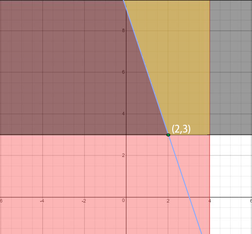

author: Ir1d, yizr-cnyali, huhaoo, QAQAutoMaton, Enter-tainer, Marcythm, sshwy, partychicken, Konano, H-J-Granger, baker221, isdanni, ksyx

## 定义

研究线性约束条件下线性目标函数极值问题的方法总称，是运筹学的一个分支，在多方面均有应用。线性规划的某些特殊情况，如网络流、多商品流量等问题都有可能在 OI 题目中出现

## 线性规划问题的描述

一个问题要能转化为线性规划问题，首先要有若干个线性约束条件，并且所求的目标函数也应该是线性的。那么，最容易也最常用的描述方法就是标准型。

我们以 《算法导论》 中线性规划一节提出的问题为例：

> 假如你是一位政治家，试图赢得一场选举，你的选区有三种：市区，郊区和乡村，这些选区分别有 100000、200000 和 50000 个选民，尽管并不是所有人都有足够的社会责任感去投票，你还是希望每个选区至少有半数选民投票以确保你可以当选
>
> 显而易见的，你是一个正直、可敬的人，然而你意识到，在某些选区，某些议题可以更有效的赢取选票。你的首要议题是修筑更多的道路、枪支管制、农场补贴以及调整汽油税。你的竞选班子可以为你估测每花费 $1000 做广告，在每个选区可以赢取或者失去的选票的数量（千人），如下表所示：

| 政策   | 市区 | 郊区 | 乡村 |
| ---- | -- | -- | -- |
| 修路   | -2 | 5  | 3  |
| 枪支管制 | 8  | 2  | -5 |
| 农场补贴 | 0  | 0  | 10 |
| 汽油税  | 10 | 0  | -2 |

你的目标是计算出要在市区，郊区和乡村分别获得至少 50000，100000 和 25000 张选票所花费的最少钱数。

我们可以使用数学语言来描述它：

$x_1$ 为花费在修路广告上的钱（千美元）

设 $x_2$ 为花费在枪支管制广告上的钱（千美元）

设 $x_3$ 为花费在农场补贴广告上的钱（千美元）

设 $x_4$ 为花费在汽油税广告上的钱（千美元）

那么我们可以将“在市区获得至少 50000 张市区选票”表述为

$-2x_1+8x_2+0x_3+10x_4 \geq 50$

同样的，“在郊区获得至少 100000 张选票和在乡村获得至少 25000 张选票”可以表示为

$5x_1+2x_2+0x_3+0x_4 \geq 100$

$3x_1-5x_2+10x_3-2x_4 \geq 25$

显而易见的，广告服务提供商不会倒贴钱给你然后做反向广告，由此可得

$x_1,x_2,x_3,x_4 \geq 0$

又因为我们的目标是使总费用最小，综上所述，原问题可以表述为：

最小化 $x_1+x_2+x_3+x_4$,

满足

$-2x_1+8x_2+0x_3+10x_4\geq50$

$5x_1+2x_2+0x_3+0x_4\geq100$

$3x_1-5x_2+10x_3-2x_4\geq25$

$x_1,x_2,x_3,x_4\geq0$

这个线性规划的解就是这个问题的最优策略

用更具有普遍性的语言说：

已知一组实数 $[a_1..a_n]$ 和一组变量 $[x_1..x_n]$, 在定义上有函数 $f(x_1..x_n)=\sum_{i=1}^na_ix_i$

这个函数是线性的。如果 b 是一个实数而满足 $f(x_1..x_n)=b$, 则这个等式被称为线性等式，同样的，满足 $f(x_1..x_n)\leq b$ 或者 $f(x_1..x_n)\geq b$ 则称之为线性不等式

在线性规划问题中，线性等式和线性不等式统称为线性约束。

一个线性规划问题是一个线性函数的极值问题，而这个线性函数应该服从于一个或者多个线性约束。

## 图解法

上面那个问题中变量较多，不便于使用图解法，所以用下面的问题来介绍图解法：

最小化 $x+y$

满足

$x+2y\leq8$

$x\leq4$

$y\geq3$

$x,y\in N$

知道这些约束条件以后，我们需要将它们在平面直角坐标系中画出来

$x\leq4$（红色区域）

$y\geq3$（黑色区域）

$x+2y\leq8$（深红色区域以及包含于 $\geq4$ 区域的浅红色区域）

打了蓝色斜线的区域为三块区域的交集，这就是这个线性规划的所有可行解。因为题目中说明，需要最小化 $x + y$，观察图像可知，在点 $(2,3)$ , $x$ 和 $y$ 同时取到最小值，此时$x + y$当然最小。因此，$min(x + y) = (2 + 3) = 5$。

把求解线性规划的图解法总结起来，就是先在坐标系中作出所有的约束条件，然后作出需要求极值的线性函数（目标函数）的图像。目标函数中所有点的集合与满足约束条件的所有点的集合的交集就是这个线性规划的解集，而所需求的极值由观察可以轻易得出。
